# Hard to Heat Homes

Hard to Heat Homes is a web-based application that helps users to identify areas where homes are harder to heat, for the purpose of identifying good locations for distributed heat networks.

This version functions as a mockup and was developed by Made Tech apprentices. It displays homes on a map, grouped into blocks of homes on a street, coloured to represent average EPC scores for the homes on that street. A popup is displayed when the user clicks on a coloured block of properties, giving detailed data for the selected area.

The current model does not display real data for properties or streets, but demonstrates what a full featured application might look like. The full-featured product would aim to build on this by implementing features such as:

- Real data for any locality across England, accessible in real-time by moving the map  
- Different levels of granularity available depending on the zoom level (so users would be able to see aggregated data for larger output areas as well as individual property data)  
- Colours based on hard-to-heat scores that combine EPC data with other relevant data such as construction type and age of properties, for example  
- More detailed information available in popups  
- The ability to filter homes by ownership type i.e. private, council or housing association

 

## Live link

As of Monday 19th January 2026, a live version of the application is available to view [here](http://13.62.98.233/).

# Getting Started

These instructions will get you a copy of the project up and running on your local machine for development and testing purposes. See deployment for notes on how to deploy the project on a live system.

## Pre-requisites

- Python 3.9+ (Download at [python.org](https://www.python.org/downloads/))  
- We recommend using [pyenv](https://github.com/pyenv/pyenv) to manage multiple versions.

## Installing

1. Check python version: Ensure you have 3.9+  
2. Create a virtual environment

```shell
python3 -m venv .venv
source venv/bin/activate
```

3. Install dependencies:

```shell
pip install -r requirements.txt
```

4. Run a local instance

```shell
flask run
```

The application runs locally on port 5000\.

# Running the tests

The tests are located in the *tests* folder.

To run them:  
	

```shell
pytest
```

Or  
	

```shell
pytest --debug
```

# Deployment

## Pre-requisites

* You have cloned and run the repository locally  
* You have Docker installed via Kandji  
* You have requested access to the Sandbox in \# cop-cloud → Workflows on Slack.  
* You have signed in to your [Madetech AWS account](%20https://madetech.awsapps.com/start/) using *Forename.Surname*  
* You have set up MFA  
* The EC2 virtual server instance is already configured (name: Hard\_to\_heat\_homes\_2.0)

## Necessary changes to the repo

In *cloud-init.yaml.tmpl* file, edit line 33 to clone your own github repo link (leave ‘/home/ubuntu/Hard\_to\_heat\_homes\_2.0’ as is)

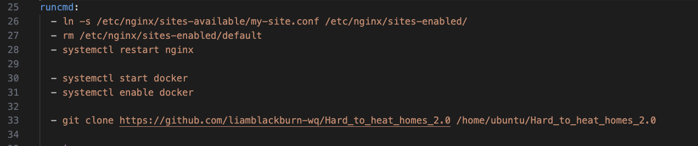

After changing line 33, you will need to create a “role” in AWS IAM. Search for “IAM” in the search bar and click the result shown below.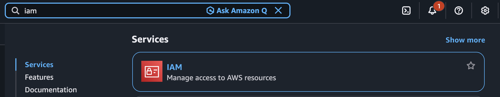

On the left sidebar under “Access Management” you should see “Roles”. Click “Roles” and then click the yellow button labelled “Create Role”.

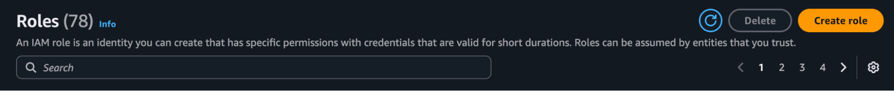

Select “Web Identity” for your trusted entity and then you will see some text boxes to fill in. 

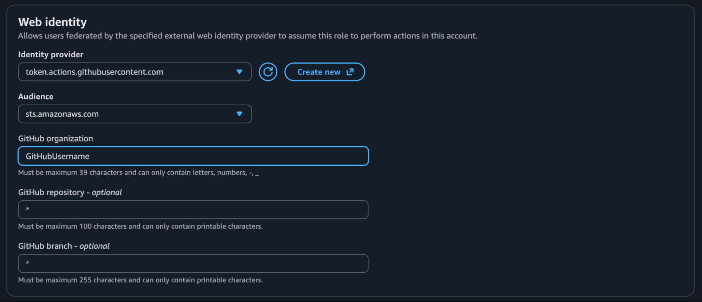

Identity provider and Audience should be the same as shown in the picture above. The GitHub organisation will be the username of whoever owns the repo. The Github repository is the **name** of your repository, not the full link. GitHub branch must be “main”.

After clicking next, you will be asked to add permissions.

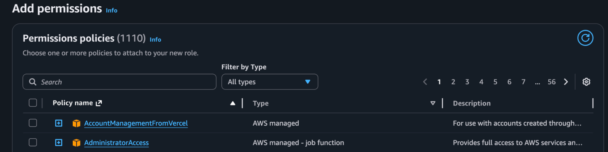

The only permission you need is “AdministratorAccess” and should be the second selection. Tick the checkbox (not the plus icon) and select next.


For your role name this can be anything you choose. Feel free to add a description too. Select “Create Role”. When you have created the role you will be taken back to the main page that lists all of the active roles. Search your role and click the link. Here is an example role that has been created for the purposes of these instructions.  
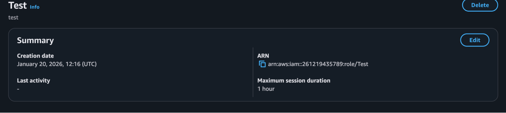

What you want from this page is the ARN key. Keep this page open and open a new browser tab and navigate to your GitHub Repo.


Select settings at the top of the page and on the left sidebar you will see “Secrets and variables” under “Security”. Click that and a list will drop down. Select “Actions”. This is where we will create your GitHub secrets. Please note that only the repo owner can navigate to this page.

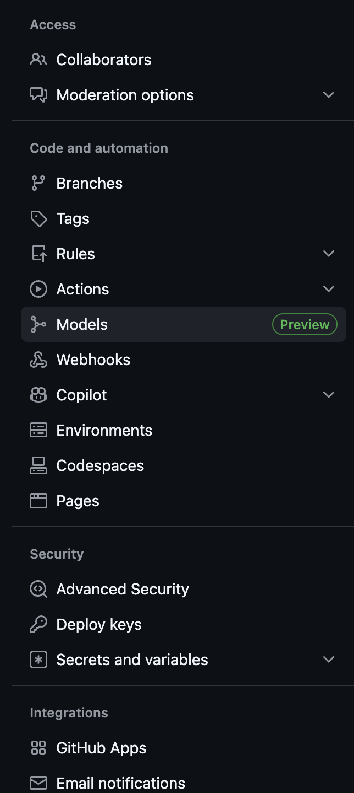

At this point you want to acquire the API and Session keys necessary to complete the next steps. Please request these from a cohort 3 team member as these are, rightfully, not in the public repo that you have forked and are securely stashed in a .env.

This is very important. Make sure that the secrets you create are named exactly as shown in the picture below.   
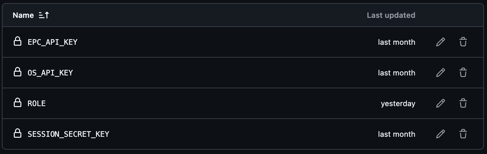

What you can do before acquiring the keys is create a secret for the AWS IAM role you created earlier.

Click “New repository secret”. For each secret you want the respective api keys. Please request these 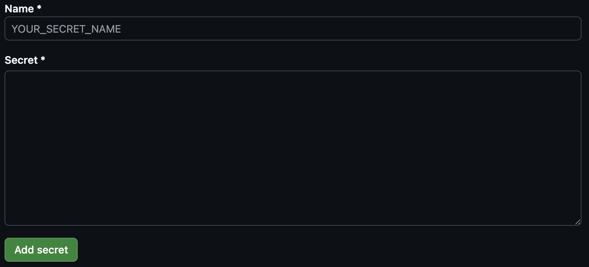

Be sure to name the secret “ROLE” and copy the whole of your role ARN key and paste it in the “Secret” text box then select “add secret”. The process is the same for the other secrets.

When you have created all of your GitHub secrets you want to navigate back to your repo home page and select “Actions” which is on the same navbar as “Settings”. You may be prompted with a popup that states "I understand my workflows, go ahead and enable them”. Agree to this. 

You are now ready to deploy your repo. Note that each time you push to the main branch you will be creating a new EC2 instance each time so be sure to delete old EC2 instances. 

When you push to main you should see the workflow happening in the github “Actions” page. If the tests and terraform passes, pat yourself on the back and navigate back to your AWS home page. Search for “EC2” like you did for “IAM” and select “Instances”. By default, the instances are listed from oldest to newest. Scroll until you see “hard-to-heat-homes-2.0”. It may have a Status Check of “Initialising” refresh the page until that changes to “3/3 checks passed”.

Finally, select your EC2 instance and below you will see the details of that instance. What you want is the Public IPv4 address. Copy that address and paste it into your browser address bar. You should now see your deployed website, congratulations. If it does not load, make sure the url is “http” and not “https”. If it is the latter, just rename it to “http” and it should work as expected.

# Built with

* **Python 3**  
* **Flask** \- the backend framework  
* **Pytest** \- the testing framework  
* **OpenStreetMap data** \- used for the base layer map and property/street boundary segments  
* **Leaflet** \- the mapping library  
* [**Gov.uk**](http://Gov.uk) **design system** \- elements and styling

# Usage

Open the live application [here](http://13.62.98.233/) or run a local copy (see “Getting Started”, above). You should see something that looks like this:

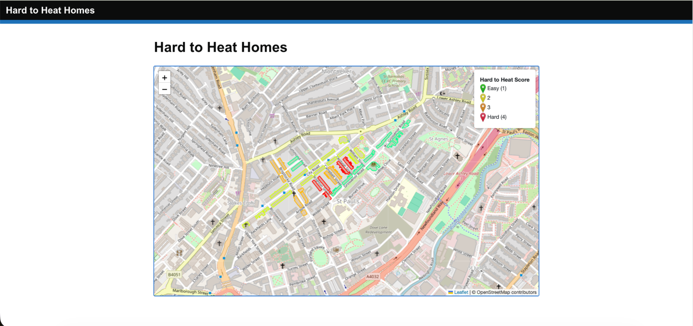

## Navigating the map

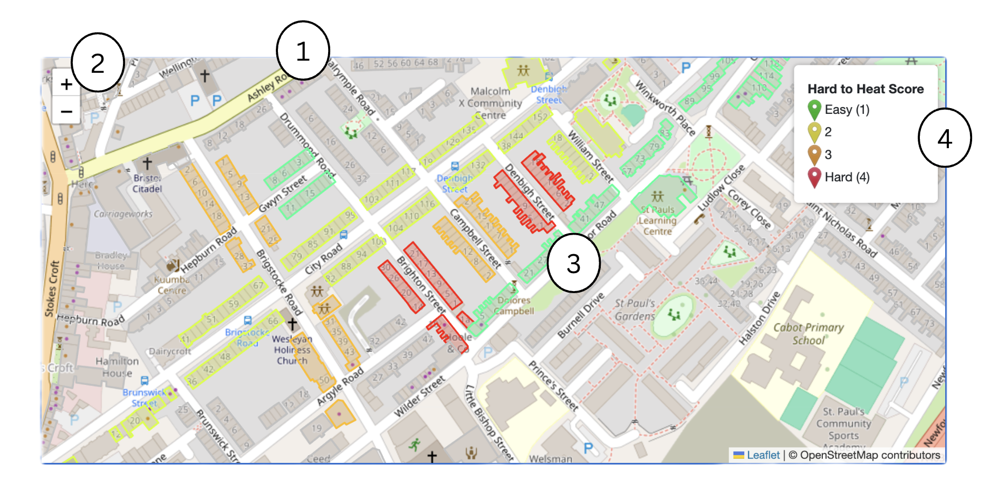

1. The map appears in the centre of the screen  
2. You can zoom in and out by clicking the \+/- buttons or using your mouse scroll wheel  
3. Street segments in the current version are coloured according to aggregated EPC score data for properties in the block  
4. The key shows what each colour means. Currently, areas with an average EPC score of less than 40 are coloured red, 41-60 coloured orange, 61-80 coloured yellow, and 81-100 coloured green.

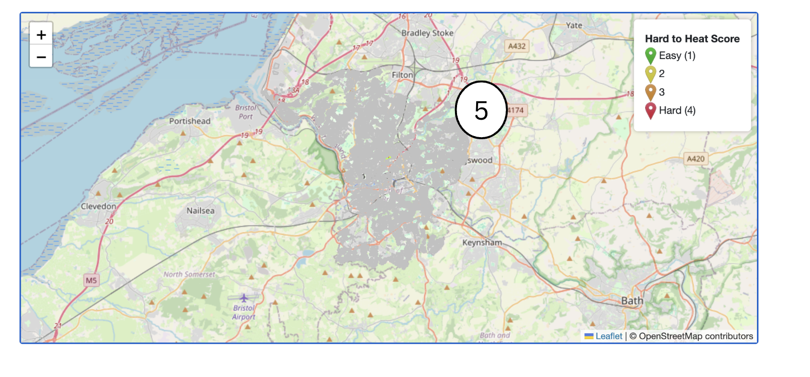

5. Zooming out shows a wider area. At present, the area of Bristol can be seen with most segments coloured grey indicating that no EPC score data is available. In future versions, zooming out would show aggregated data over larger areas across England.

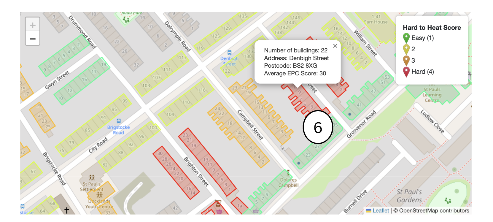

6. Clicking on a coloured segment makes a popup appear with detailed information for that segment. In more advanced versions, more data would be available.

# Contributing

To extend HTHH3.1, please fork the repository via Github.

# Next steps

Currently we have a prototype that is a map that uses Openstreetmap building polygons grouped by street name into street polygons. They vary in colour depending on fixed EPC scores we have assigned to a handful of streets. In the future we would like to:

* Create blocks for each USRN in Bristol  
* Get EPC scores for each Unique Property Reference Number (UPRN),  aggregate them to the Unique Street Reference Number (USRN) level and colour street blocks according to this more accurate source.  
* Switch from street blocks to properties on zooming in further and street blocks to output areas of varying sizes on zooming out further.

This could be achieved by:

* Using the OS Linked Identifiers to identify all the properties on a street.  
* Obtaining data for larger areas in geoJSON format, for example the ONS Geoportal data available [here](https://geoportal.statistics.gov.uk/datasets/ons::output-areas-december-2021-boundaries-ew-bfe-v9-and-rural-urban-classification/about), which maps census output area boundaries, or grouping the property boundary data by postcode stem for an even wider view. This data could be added as a map layer  
* Processing the data to add hard-to-heat scores for each property, based on EPC information  
* Storing the data in a database on the application server  
* Using Leaflet or another mapping library to dynamically load data from the database based on map viewer position and zoom level

# Data sources

* **Open Street Map Tiles API** \- used for the base layer map (https://operations.osmfoundation.org/policies/tiles)   
* **Overpass Turbo** \- used for extracting property boundaries and data (https://overpass-turbo.eu)  
* **Ministry of Housing, Communities and Local Government \- EPC API** (not used in the current mockup, but will be a source for EPC data (https://www.api.gov.uk/mhclg/energy-performance-certificates-domestic-certificates-api/\#energy-performance-certificates-domestic-certificates-api)  
* More detailed information about possible data sources we considered for past and future versions is available [here](http://here).